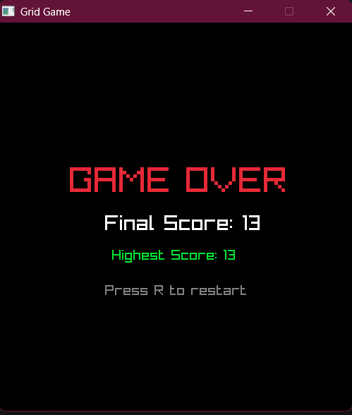
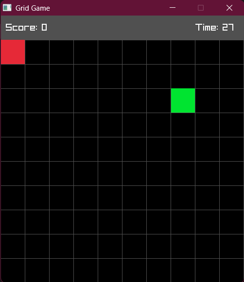

# Ultra-Mini-Projects
A collection of projects I learned from following various resources on the internet and modified them

## Terminal Grid Game using Raylib and C++
Developed a simple Terminal Grid Game where the objective is to bring red block to green block and collect points under 30 seconds. 
Features:-
<ul>
<li>20x20 grid</li>
<li>BFS for finding shortest path to the objective from any start point</li>
<li>Random Obstacles generation at each round</li>

</ul>

  
  

